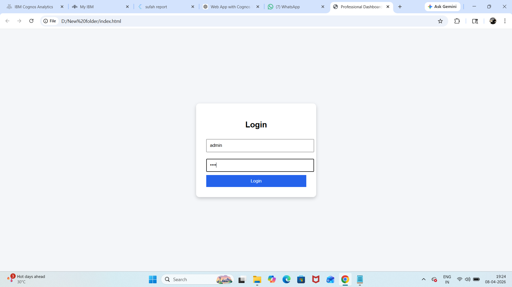
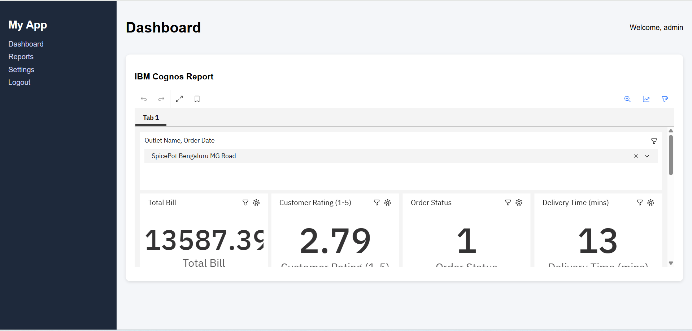
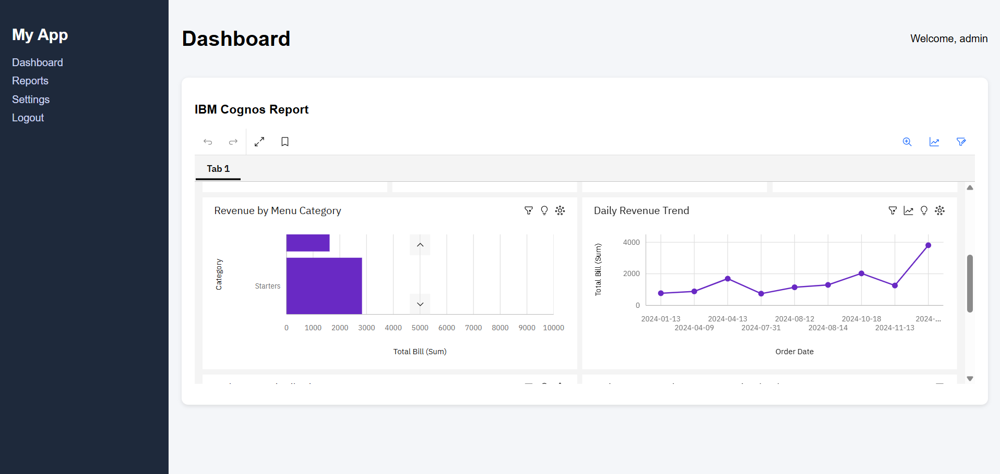
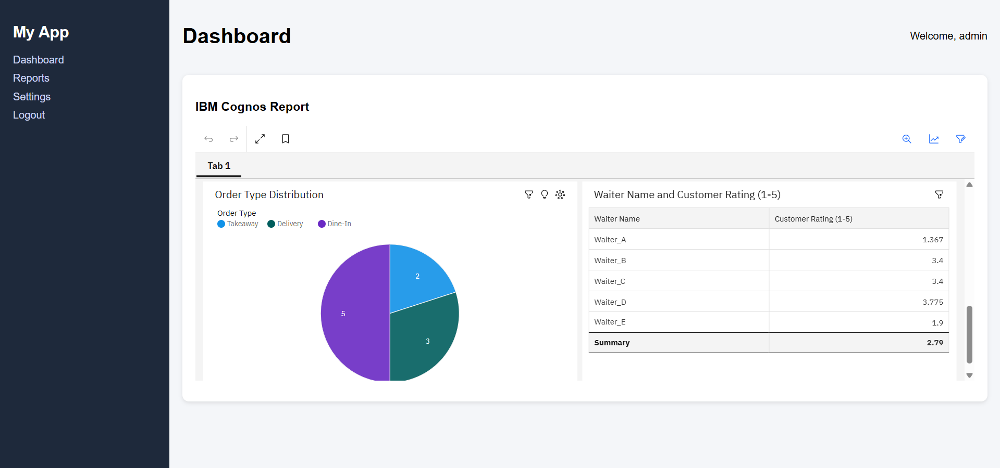

Professional Dashboard App:

This is a simple dashboard web application created using HTML, CSS, and JavaScript. 
The goal of this project is to understand how a basic dashboard layout works along with a login system and report integration.

 Features:
Login page with username and password
Sidebar navigation menu
Dashboard layout with header and content section
Embedded IBM Cognos report using iframe
User session stored using localStorage
Simple and clean UI design

Technologies Used:
HTML
CSS
JavaScript

 Project Files:
index.html  - Main file that contains UI, styles, and script
README.md   - Project description

Screenshots:

 Login Page

Dashboard

Login Details:
Use these credentials to access the dashboard:
Username: admin  
Password: 1234

How to Run the Project:
Download or clone the repository
Open the project folder
Open index.html in any browser
That’s it — no installation needed.

Notes:
This project uses localStorage for login, so it is not secure for real applications
The IBM Cognos report is added using a public embed link
This is mainly for learning and practice purposes

Future Improvements:
Add backend authentication
Connect with real database
Improve UI design
Add more dashboard features

Conclusion:
I created this project to get a clear idea of how a dashboard application works from a front-end perspective. 
t helped me understand layout design, basic authentication logic, and how external reports can be integrated into a web app.
There’s still a lot that can be improved, but this serves as a good starting point for building more advanced applications.
